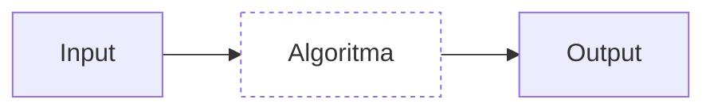

# Perkenalan

Selamat datang pada short course 'Algoritma menggunakan Python' ini! Setelah menyelesaikan course ini, kalian diharapkan sudah memahami dasar-dasar algoritma dan bisa melakukan pemrograman dasar menggunakan Python secara mandiri. Tanpa panjang lebar, yuk langsung ke bagian selanjutnya!

## Apa itu algoritma?

Definisi algoritma itu banyak dan mudah saja dicari di internet. Namun pada dasarnya, algoritma itu adalah sebuah **set instruksi** yang dapat dilakukan untuk menyelesaikan suatu masalah. Dalam konteks ini (dan dalam lingkup yang luas), set instruksi ini dibuat oleh manusia dan diberikan ke komputer untuk kemudian dijalankan atau dilakukan pemrosesan.

## Mengapa belajar algoritma itu penting?

Dalam implementasinya, set instruksi ini bentuknya bisa bermacam tergantung dengan bahasa pemrograman yang dipilih. Sebagai contoh, sintaks dari bahasa C akan berbeda dengan sintaks dari bahasa Python. 

**Perbedaan sintaks dari bahasa C dan Python untuk melakukan print 'Hello, world!'**

```c
// Bahasa C
#include <stdio.h>

int main(void)
{
    printf("Hello, world!\n");
}
```

```python
# Bahasa python
print('Hello, world!')
```

Meskipun demikian, konsep dari set instruksi atau algoritma ini memiliki fundamental yang sama. Sehingga, apabila teman-teman telah memahami dengan benar konsep dari algoritma, belajar bahasa pemrograman baru akan jauh lebih mudah.

Pada course ini, Python dipilih karena bahasanya relatif mudah, fungsi-fungsinya lengkap, dan kegunaannya sangat luas (bisa untuk scripting, data analysis dsb). 

## Input dan Output

Mengimplementasikan sebuah algoritma tidak luput dari konsep input dan output.



Suatu algoritma dikatakan berhasil atau menyelesaikan masalah apabila algoritma tersebut dapat menghasilkan output yang dikehendaki sesuai dengan input yang diberikan. Sehingga, masalah yang sama dapat diselesaikan dengan solusi algoritma yang berbeda-beda. Jadi, kalau nanti di bagian exercise kalian memiliki solusi yang berbeda dari kunci jawaban, itu sama sekali tidak menjadi persoalan.