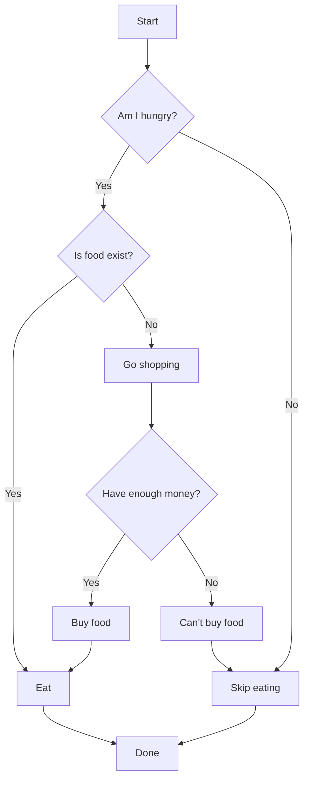
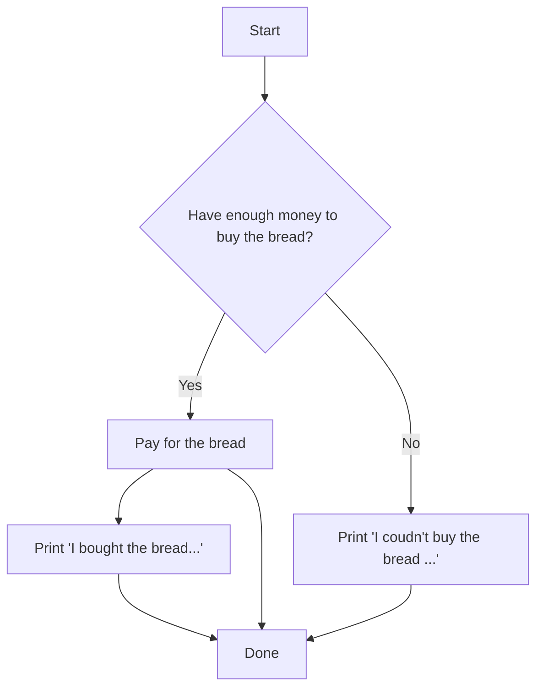
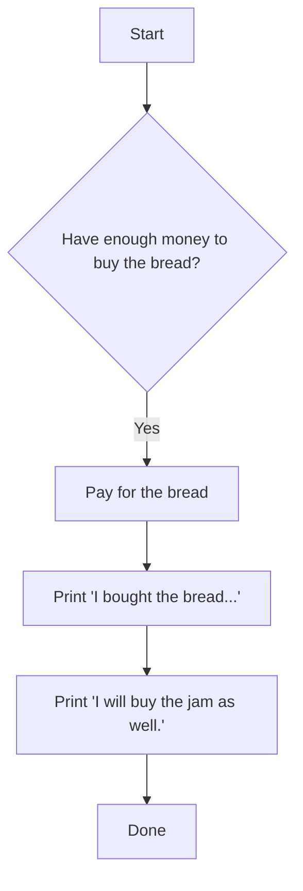
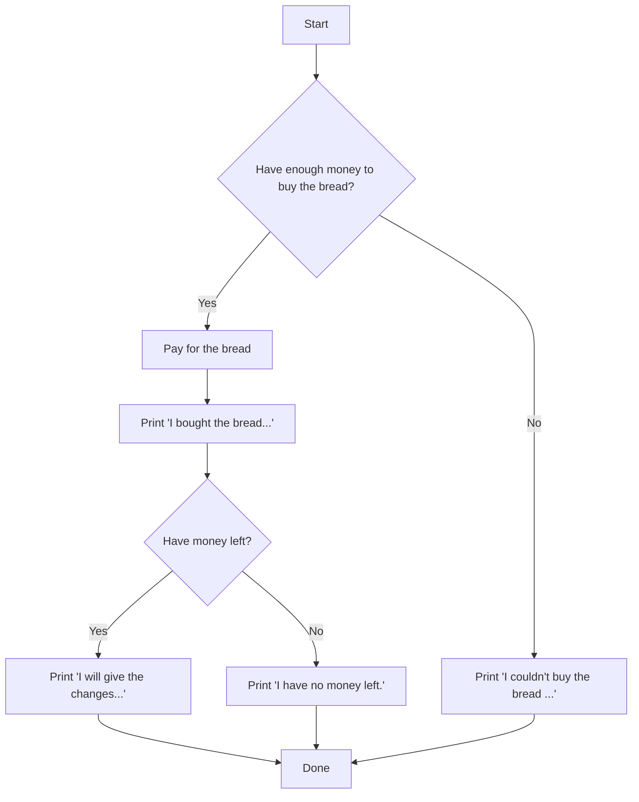

# Conditionals

Conditionals adalah konsep programming yang memberikan perintah kepada komputer untuk melakukan keputusan dan menjalankan suatu proses berdasarkan hasil dari logika perbandingan/boolean. Konsep ini dapat divisualisasikan ke dalam bentuk diagram flowchart. Diagram berikut mengilustrasikan contoh skenario untuk memutuskan apakah seseorang akan makan atau tidak.



Skenario pada contoh dapat diimplementasikan ke dalam kode dengan memanfaatkan sintaks Python. Yuk kita ikuti pembahasan lebih detailnya!

## If else

Untuk mengimplementasikan skenario pemilihan keputusan pada Python, kita dapat menggunakan sintaks `if else`. Sintaks dasarnya adalah seperti berikut:

```python
if condition:
    # Kode yang dijalankan apabila condition bernilai True
else:
    # Kode yang dijalankan apabila condition bernilai False
```

Untuk lebih jelasnya, perhatikan contoh kode di bawah ini:

```python
# Contoh 1.a

money_on_wallet = 100
price_of_bread = 99

if money_on_wallet >= price_of_bread:
    money_on_wallet = money_on_wallet - price_of_bread
    print(f'I bought the bread. I have ${money_on_wallet} money left on my wallet.')
else:
    print(f'I couldn\'t buy the bread because I don\'t have enough money.')

# output: 'I bought the bread. I have 1 money left on my wallet.'
```

Apabila kode pada contoh 1.a dijalankan, komputer hanya akan melakukan operasi pengurangan pada variable `money_on_wallet` dan menjalankan fungsi `print` yang pertama karena `money_on_wallet >= price_of_bread` akan menghasilkan nilai `True`, sedangkan fungsi `print` yang kedua akan di-skip. 


*Ilustrasi flowchart untuk contoh 1.a*

Apa yang akan terjadi jika kita mengganti nilai `price_of_bread` menjadi `101`? Kondisi `money_on_wallet >= price_of_bread` akan menghasilkan nilai `False` sehingga hanya fungsi `print` yang kedua yang akan dieksekusi.

Perhatikan kembali contoh selanjutnya:

```python
# Contoh 1.b

money_on_wallet = 100
price_of_bread = 99

if money_on_wallet >= price_of_bread:
    money_on_wallet = money_on_wallet - price_of_bread
    print(f'I bought the bread. I have ${money_on_wallet} money left on my wallet.')

print(f'I will buy the jam as well.')

# output: 
# 'I bought the bread. I have 1 money left on my wallet.'
# 'I will buy the jam as well.'
```

Apabila kode baru pada contoh 1.b dijalankan, komputer hanya akan melakukan operasi pengurangan, menjalankan fungsi `print` yang pertama *dan* menjalankan fungsi `print` yang kedua. Hal ini disebabkan fungsi `print` yang kedua sudah tidak lagi di dalam blok kode `else`. 


*Ilustrasi flowchart untuk contoh 1.b*

Apa yang akan terjadi jika kita mengganti nilai `price_of_bread` menjadi `101`? Nilai `money_on_wallet >= price_of_bread` akan berubah menjadi `False`, namun perubahan ini tidak memengaruhi eksekusi dari fungsi `print` yang kedua (tetap dilakukan pemanggilan) karena baris tersebut tidak ada di dalam blok kode `if` maupun `else`.

> [!TIP]
> - Kode yang ingin dieksekusi di dalam blok kode `if` dan `else` harus menggunakan indentasi pada awal baris. Kamu dapat menggunakan tab atau space sebagai indentasi.
> - Supaya program Python-nya tidak bingung, penggunaan indentasi harus konsisten. Kamu bisa memilih salah satu style, lalu terapkan ke semua kode yang kamu buat.

Sintaks `if else` juga bisa digunakan secara nested apabila skenario yang ingin dibuat lebih kompleks seperti contoh berikut ini:

```python
# Contoh 1.c

money_on_wallet = 100
price_of_bread = 99

if money_on_wallet >= price_of_bread:
    money_on_wallet = money_on_wallet - price_of_bread
    print('I bought the bread.')

    if money_on_wallet > 0:
        print('I will give the changes to the street singer.')
    else:
        print('I have no money left.')
else:
    print('I couldn\'t buy the bread.')

# Output:
# 'I bought the bread.'
# 'I will give the changes to the street singer.'
```


*Ilustrasi flowchart untuk contoh 1.b*

---

Kita dapat menggunakan sintaks `elif` (else if) untuk membuat skenario yang menggabungkan beberapa kondisi sekaligus. Sintaks dasarnya adalah seperti berikut:

```python
if condition_1:
    # Kode yang dijalankan apabila condition_1 bernilai True
elif condition_2:
    # Kode yang dijalankan apabila condition_2 bernilai True
elif condition_3:
    # Kode yang dijalankan apabila condition_3 bernilai True
else:
    # Kode yang dijalankan apabila tidak ada condition yang bernilai True
```

> [!TIP]
> Sebagai latihan, coba terjemahkan skenario pada contoh diagram flowchart yang paling pertama ke dalam kode Python. Kira-kira kodenya seperti apa ya?

## Switch

## Ternary