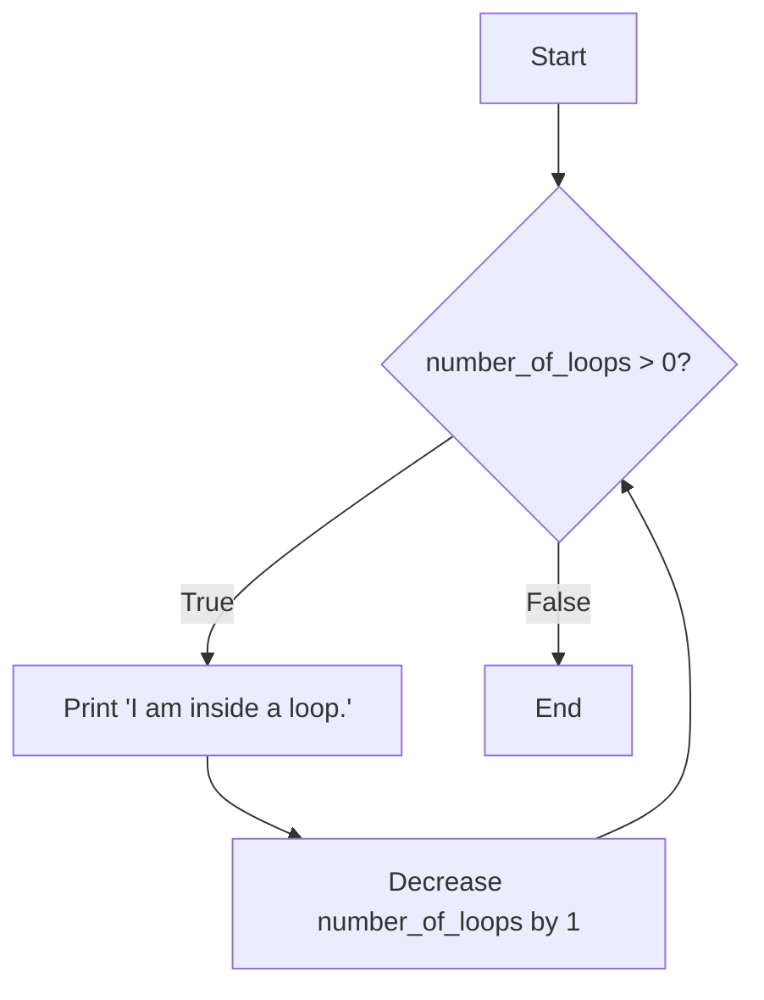
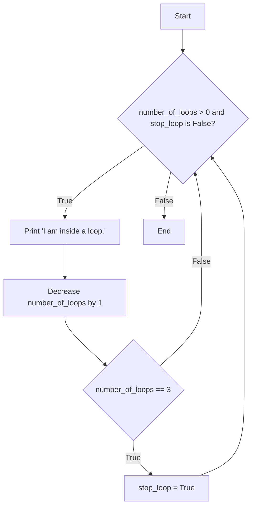
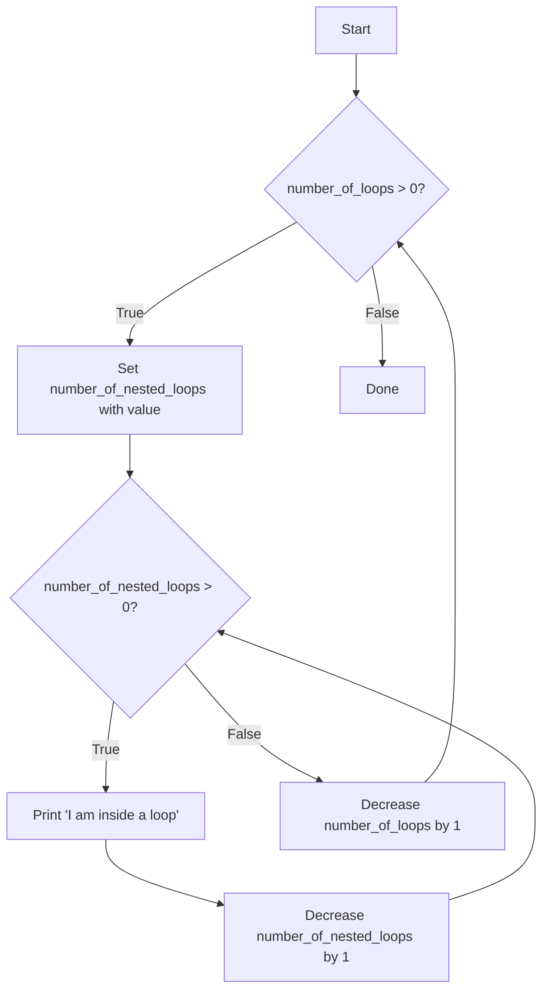

# Looping dan Debugging

Looping atau perulangan adalah konsep pemrograman yang memberikan perintah kepada komputer untuk menjalankan suatu proses secara berulang-ulang selama kondisi atau kriteria yang diberikan masih valid. Pada bab ini, kita akan belajar bagaimana membuat looping pada Python dengan sintaks `while` dan `for`, dan juga belajar bagaimana cara melakukan debugging untuk mengecek kesalahan dan memperbaiki kode kita.

## While

Sintaks dasar pembuatan looping dengan `while` dapat dilihat pada contoh berikut:

```python
while condition:
    # Kode yang dijalankan apabila condition bernilai True
```

Untuk lebih jelasnya, perhatikan contoh kode di bawah ini:

```python
# Contoh 1.a
number_of_loops = 3

while number_of_loops > 0:
    print("I am inside a loop.")
    number_of_loops = number_of_loops - 1

# output:
# 'I am inside a loop.'
# 'I am inside a loop.'
# 'I am inside a loop.'
```

Apabila kode pada Contoh 1.a dijalankan, komputer akan mengeksekusi kode yang ada di dalam loop secara berulang-ulang selama variable `number_of_loops` bernilai lebih dari 0. Namun, pada akhirnya loop akan berhenti pada iterasi ketiga karena di dalam loop ada kode yang melakukan operasi pengurangan terhadap nilai `number_of_loops` di setiap perulangan. Sehingga, output akan menyetak string 'I am inside a loop.' sebanyak 3 kali.


*Ilustrasi diagram untuk Contoh 1.a*

Melakukan operasi pengurangan terhadap nilai `number_of_loops` di dalam blok kode `while` adalah penting agar kondisi stopnya bisa tercapai dan proses loop bisa berhenti melakukan eksekusi kode. Apabila operasi pengurangan ini dihilangkan, maka kondisi stopnya tidak akan terpenuhi dan program Python akan terus menjalankan baris kode di dalam `while` tanpa berhenti. Hal ini disebut dengan istilah *infinite looping*.

```python
# Contoh 1.b
# Perhatian: 
# Kode di bawah akan menyetak string secara berulang-ulang tanpa berhenti.
# Untuk menghentikannya, tekan Ctrl-C pada keyboard.
number_of_loops = 3

while number_of_loops > 0:
    print("I am inside a loop.")

# output:
# 'I am inside a loop."
# 'I am inside a loop."
# 'I am inside a loop."
# 'I am inside a loop."
# 'I am inside a loop."
# ...
```

Kita juga bisa membuat conditional di dalam blok kode `while` untuk mengontrol perulangan. Perhatikan contoh di bawah ini:

```python
# Contoh 1.b
number_of_loops = 5
stop_loop = False

while number_of_loops > 0 and stop_loop == False:
    print("I am inside a loop.")
    number_of_loops = number_of_loops - 1
    if number_of_loops == 3:
        stop_loop = True

# output:
# 'I am inside a loop.'
# 'I am inside a loop.'
```

Apabila kode pada contoh 1.b dijalankan, program Python hanya akan mencetak string sebanyak 2 kali. Hal ini disebabkan kondisi pada `while` melakukan pengecekan terhadap nilai dari variable `stop_loop`. Pada saat yang bersamaan, di dalam blok kode `while` ada conditional yang melakukan perubahan nilai `stop_loop` dari `False` menjadi `True` apabila variable `number_of_loops`-nya bernilai 3. Sehingga, saat nilai `stop_loop` menjadi `True`, kondisi pada `while` akan menghasilkan nilai `False` dan akhirnya mengakibatkan loop berhenti.


*Ilustrasi diagram untuk Contoh 1.b*

Selain conditional, kita juga dapat membuat `while` di dalam blok kode `while` untuk membuat *nested loop*.

```python
# Contoh 1.c
number_of_loops = 3

while number_of_loops > 0:
    number_of_nested_loops = 3

    while number_of_nested_loops > 0:
        print("I am inside a loop.")
        number_of_nested_loops = number_of_nested_loops - 1

    number_of_loops = number_of_loops - 1

# output:
# "I am inside a loop."
# "I am inside a loop."
# "I am inside a loop."
# "I am inside a loop."
# "I am inside a loop."
# "I am inside a loop."
# "I am inside a loop."
# "I am inside a loop."
# "I am inside a loop."
```


*Ilustrasi diagram untuk Contoh 1.c*

## For

Sintaks dasar pembuatan looping dengan `for` dapat dilihat pada contoh berikut:

```python
for item in data_structure:
    # Kode yang dijalankan selama masih ada item yang belum dikunjungi dari data_structure 
```

Untuk lebih jelasnya, perhatikan contoh kode di bawah ini:

```python
# Contoh 2.a
fruits = ['apple', 'banana', 'grapes', 'oranges', 'strawberry']

for fruit in fruits:
    print(f'I like {fruit}.')

# output:
# 'I like apple.'
# 'I like banana.'
# 'I like grapes.'
# 'I like oranges.'
# 'I like strawberry.'
```

Ada perbedaan mendasar antara penggunaan `for` dengan `while` untuk pembuatan looping. Looping dengan `while` memerlukan kondisi yang eksplisit untuk menentukan apakah iterasi masih berjalan atau stop. Sedangkan looping dengan `for` tidak memerlukan kondisi yang eksplisit. Sebagai gantinya, `for` harus selalu dipasangkan dengan suatu data structure, seperti pada Contoh 2.a yang menggunakan `list`. 

Algoritma `for` akan mengunjungi satu per satu item yang terdapat pada `list` mulai dari item pada index yang pertama hingga item pada index yang terakhir. Itulah mengapa apabila dijalankan, kode pada Contoh 2.a akan menyetak `string` 'I like ...' sebanyak 5 kali dengan nama buah yang bergantian dan berurutan sesuai urutan item dalam `list`.

```mermaid
flowchart TD
    A[Start] --> B{Is there any fruit next?}
    B -- Yes --> C[Print 'I like {next fruit}.']
    C --> B
    B -- No --> D[Done]
```
*Ilustrasi diagram untuk contoh 2.a*

Kita juga bisa membuat kode seperti pada Contoh 2.a dengan menggunakan sintaks `while`. Coba bandingkan contoh berikut dengan kode sebelumnya:

```python
# Contoh 2.b
fruits = ['apple', 'banana', 'grapes', 'oranges', 'strawberry']
index = 0

while index < len(fruits):
    fruit = fruits[index]
    print(f'I like {fruit}.')
    index = index + 1

# output:
# 'I like apple.'
# 'I like banana.'
# 'I like grapes.'
# 'I like oranges.'
# 'I like strawberry.'
```

Selain `list`, kita juga bisa melakukan looping terhadap data structure `dictionary`. Perhatikan contoh berikut: 

```python
# Contoh 2.c
payment_config = {
    'base_price': 50000,
    'delivery_fee': 5000,
    'discount_rate': 0.25
}

for key, value in payment_config.items():
    print(f'The value of {key} is {value}.')

# output:
# 'The value of base_price is 50000.'
# 'The value of delivery_fee is 5000.'
# 'The value of discount_rate is 0.25.'
```

Pada Contoh 2.c, kita bisa mendapatkan key dan value secara bersamaan dan dapat digunakan di dalam blok kode `for`.

---

Seperti halnya `list`, kita juga bisa membuat nested loop menggunakan `for` seperti pada contoh di bawah ini:

```python
# Contoh 2.d
bucket_of_words = [
    ['I', 'like', 'learning', 'new', 'stuffs'],
    ['However,', 'it', 'is', 'not', 'always', 'easy'],
    ['I', 'believe', 'if', 'I', 'consistently', 'practice,', 'I', 'can', 'get', 'a', 'valuable', 'skill', 'faster']
]

for words in bucket_of_words:
    sentence = ""
    for word in words:
        sentence = sentence + word + ' '
    print(sentence)
```

> [!TIP]
> - Kode yang ingin dieksekusi di dalam blok kode `while` dan `for` harus menggunakan indentasi pada awal baris. Kamu dapat menggunakan tab atau space sebagai indentasi.
> - Supaya program Python-nya tidak bingung, penggunaan indentasi harus konsisten. Kamu bisa memilih salah satu style, lalu terapkan ke semua kode yang kamu buat.

## Debugging

TBA